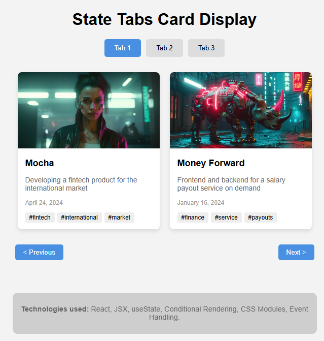

# React + Vite

// 1 - Создать состояние isOpen для управления открытием и закрытием приложения. Интерфейс скрывается при нажатии на крестик и отображается при нажатии на кнопку "Начать".

// 2 - Реализовать функционал отображения карточек в зависимости от активного таба. Переключать табы можно как нажатием на кнопки "Prev" и "Next", так и нажатием на сам таб.

Для установки пакетов:
npm install

Запустить локальный сервер:
npm run dev
